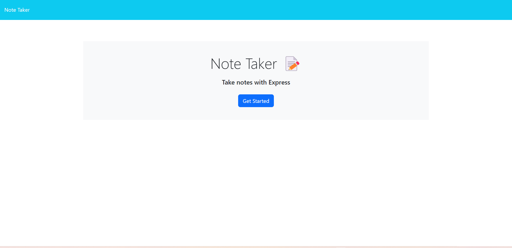
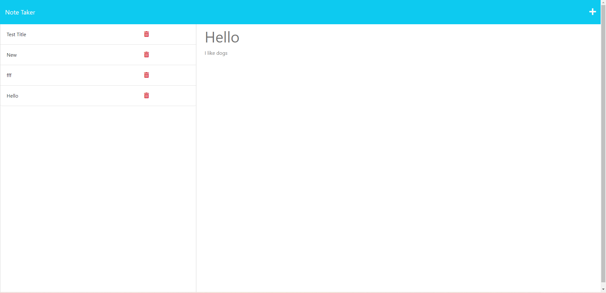

# AwesomeNoteTaker

This is an application that will allow the user to input any notes with a Title and text within the note and be able to save these notes when the user clicks the save button at the top right of the screen. When a user clicks on an old note, the note will be displayed with its content on the page. 

Screenshot: 

Screenshot 2: 

Live URL: 